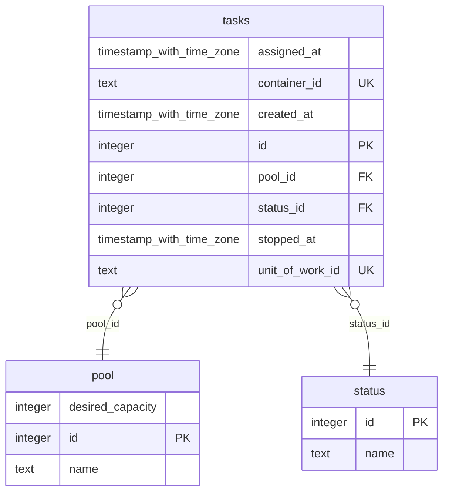

# DESIGN

Simple DB for tracking tasks and allocations.  

TODO:

* A table to track processes that are sets of multiple tasks from different pools.
* Launch tasks to fill desired capacity
* Allocate tasks randomly
* Open transactions for assigning work.
  * Add lauching tasks without locking.
  * Assigning tasks with locking
* Have pools active and deactivated

## ACTIONS

Task Status:

* Launching
* Ready
* Assigned
* Complete

1. AddTask(PoolId, TaskId, "Ready")

   Register a task into a pool and mark as available.

2. AssignTask(PoolId, WorkloadId, "Assigned")

   Find a free task in the pool and assign it a workloadId

3. WorkloadComplete(WorkloaId, "Complete")

   Mark workload as complete.

4. PoolCapacity(PoolId)

   How many available tasks in a pool?

5. DesiredCapacity(PoolId)

   What is the desired capacity?

## SCHEMA

## Resources
